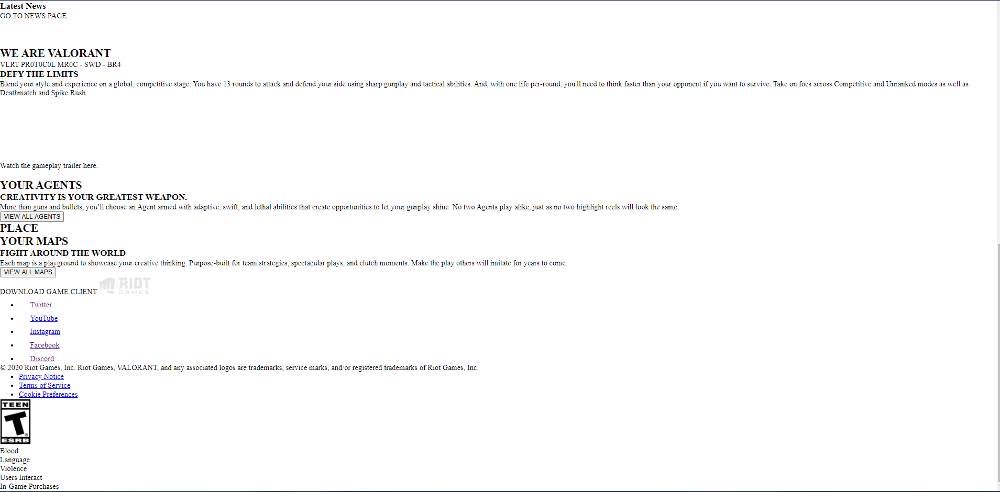
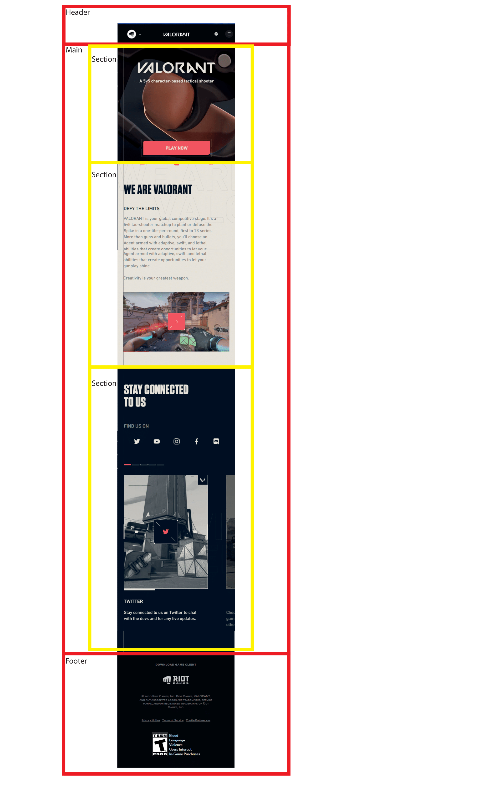
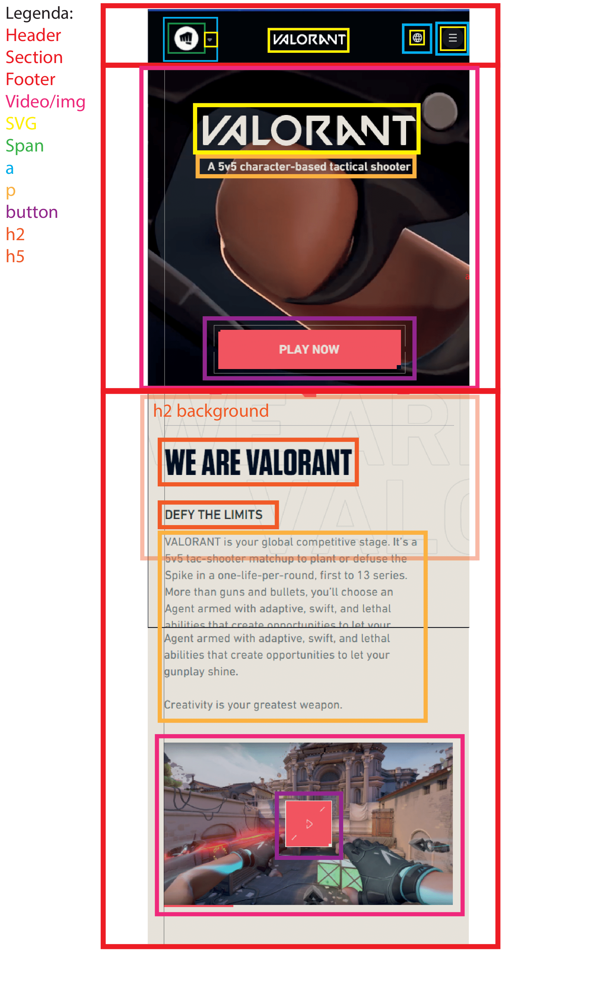
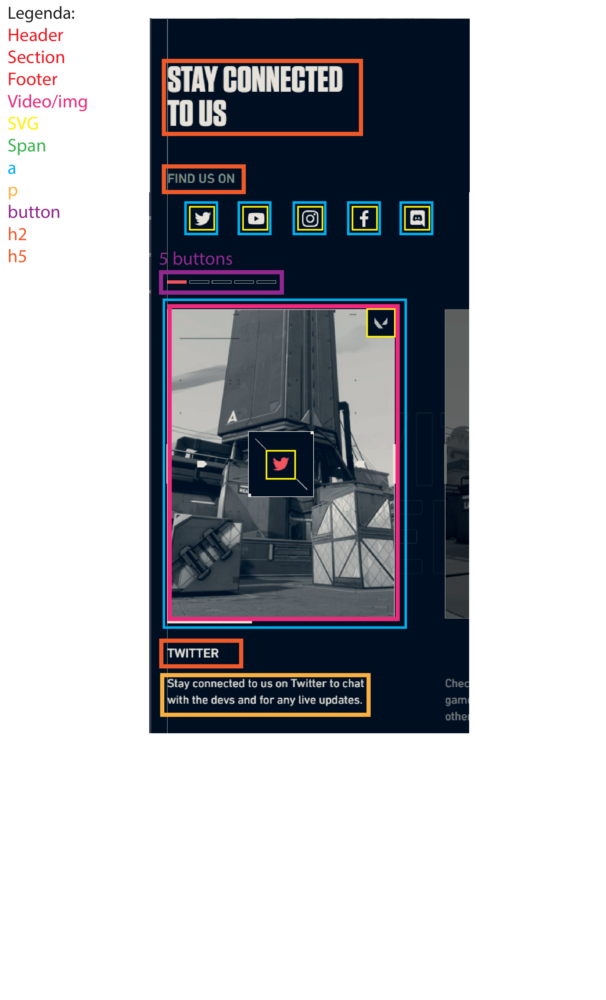
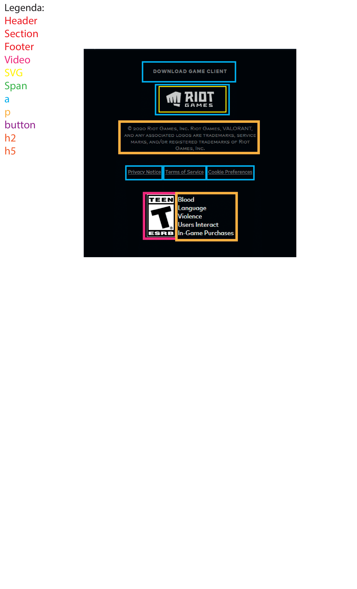

# Procesverslag
**Auteur:** Raekwon Gerold

Markdown cheat cheet: [Hulp bij het schrijven van Markdown](https://github.com/adam-p/markdown-here/wiki/Markdown-Cheatsheet). Nb. de standaardstructuur en de spartaanse opmaak zijn helemaal prima. Het gaat om de inhoud van je procesverslag. Besteedt de tijd voor pracht en praal aan je website.

## Bronnenlijst
1. [De Originele site](https://playvalorant.com/)
2. https://redstapler.co/responsive-css-video-background/
3. https://codepen.io/Axiol/pen/mdeyWwQ
4. https://codepen.io/Phong6698/pen/pojVjjq
5. https://stackoverflow.com/questions/5527296/how-can-i-detect-scroll-end-of-the-specified-element-by-javascript

## Eindgesprek (week 7/8)

1. Dit ging goed:
* Opgang komen als iets lukte

2. Dit was lastig:
* Motivatie vinden als er iets te lang fout ging
* Responsive maken
* Mobiele look niet vergeten
* Toevoegen van javascript, meeste was een css animation.
* Special ability slider? weet niet wat het is op de agent slider.

**Screenshot(s):**

-screenshot(s) van je eindresultaat-

Homepage:

Agent page:

## Voortgang 3 (week 6)

### Stand van zaken

1. dit ging goed: 
* To be honest, I don't know.

2. dit was lastig:
* Focusen op werk
* Combineren met andere vak problemen

**Screenshot(s):**

Komt nog.

### Agenda voor meeting

-samen met je groepje opstellen-

| Marjolein      | Nazier          | Raekwon    | Thuan-Hoa        |
| ---            | ---                | ---          | ---              |
| dit bespreken  | en dit             | Video achtergrond op homepage    | en dan ik dat    |
| an dat ook nog | dit als er tijd is | Twijfel tussen Maps en Agents Page | dit wil ik zeker |Ho
| ...            | ...                | Waar het beste is om grid toe te passen          | ...              |

### Verslag van meeting

-na afloop snel uitkomsten vastleggen-

## Voortgang 2 (week 5)

### Stand van zaken

1. dit ging goed: 
* Verder werken aan de pagina, nog niet zo ver als dat ik wil zijn.
* Vullen van de bestanden met content zo ver het lukte, basis css toegevoe. 

2. dit was lastig:
* Werkend krijgen van video achtergronden tot nu toe. (Riot Games is evil (Als je klikt op de link voor maps speelt de video op eens wel af??????))
* Werken aan FED terwijl je ziek bent.
* Bedenken hoe ik de agents pagina werkend zou krijgen

**Screenshot(s):**

_Screenshots nog toevoegen_

### Agenda voor meeting

-samen met je groepje opstellen-
 Raekwon  
| ---            |
| Video achtergrond op homepage    |
| semantisch correct content toevoegen |
| Verandering pagina van Agents naar Maps           |

### Verslag van meeting

-na afloop snel uitkomsten vastleggen-

## Voortgang 1 (week 3)

### Stand van zaken

1. dit ging goed: 
* Aanmaken van de HTML, CSS bestanden.
* Vullen van de bestanden met content zo ver het lukte. 

2. dit was lastig:
* Werkend krijgen van videos, achtergronden tot nu toe.
* de visuele content toepassen

**Screenshot(s):**

### Agenda voor meeting

-samen met je groepje opstellen-

| Marjolein      | Nazier          | Raekwon    | Thuan-Hoa        |
| ---            | ---                | ---          | ---              |
| dit bespreken  | en dit             | Video achtergrond op homepage    | en dan ik dat    |
| an dat ook nog | dit als er tijd is | semantisch correct content toevoegen | dit wil ik zeker |
| ...            | ...                | ...          | ...              |

### Verslag van meeting

-na afloop snel uitkomsten vastleggen-
Veel te doen nog, kijk hoe ver je komt, stel vragen.

## Breakdownschets (week 1)

-uitwerken voor de 1e werkgroep - eind van de eerste week-

## Intake (week 1)
-uitwerken voor de kick-off werkgroep - begin van de eerste week-

**Je startniveau:** Rood

**Je focus:** Beide lijken me wel leuk te doen

**Je opdracht:** https://playvalorant.com/ en https://playvalorant.com/en-us/agents/

**Screenshot(s) van de eerste pagina (small screen):**

**Screenshot(s) van de tweede pagina (small screen):**

